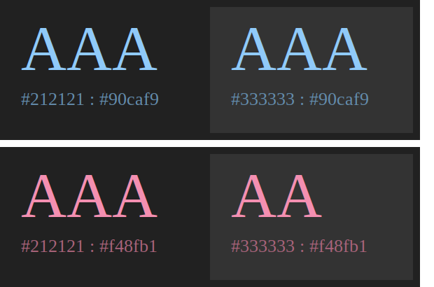

변경 사항이 있는 Pull Request

# 목표

1. 예제로 주어진 [Material-UI Color Palette](https://github.com/iamssen/wcag-contrast-validation-example/blob/master/example/src/style/theme.ts)의 [WCAG Contrast Ratio 접근성을 계산](https://github.com/iamssen/wcag-contrast-validation-example/blob/master/example/src/%40ssen/anlayze-wcag-contrast/analyzeWCAGContrast.tsx)합니다.
2. Git [Pre-Commit Hook을 사용해서 Report를 작성](https://github.com/iamssen/wcag-contrast-validation-example/blob/master/example/scripts/validate-wcag-contrast.tsx)합니다. (CI 상에서는 Report 파일들의 저장 문제 등 Back-End 비용이 발생하므로 Pre-Commit 상에서 진행합니다.)
3. [CI의 `master` Branch Commit이 발생](https://github.com/iamssen/wcag-contrast-validation-example/blob/master/.github/workflows/validate.yml#L54)하면 [Report Image를 Commit에 Comment로 보여줍니다.](https://github.com/iamssen/wcag-contrast-validation-example/blob/master/example/scripts/validate-master-commit.ts)
4. [CI에 Pull Request가 발생](https://github.com/iamssen/wcag-contrast-validation-example/blob/master/.github/workflows/validate.yml#L58)하면 [PR Base의 Report와 PR의 Report를 비교해서 Score 증감을 계산한 다음 Pull Request에 Comment로 보여줍니다.](https://github.com/iamssen/wcag-contrast-validation-example/blob/master/example/scripts/validate-pull-request.ts)

# Previews

# TODOs

- [x] WCAG Contrast Ratio Report
- [x] Git Pre-Commit Hook
- [x] Github Sticky Comment Library
- [x] Github Action Bot
