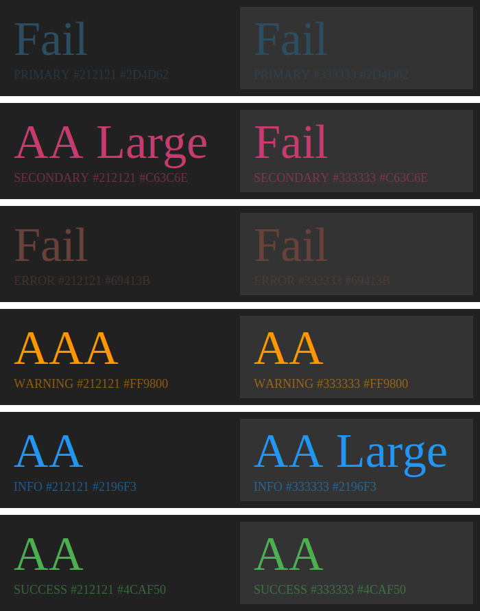

# 목표

1. 예제로 주어진 [Material-UI Color Palette](https://github.com/iamssen/wcag-contrast-validation-example/blob/master/example/src/style/theme.ts)의 [WCAG Contrast Ratio 접근성을 계산](https://github.com/iamssen/wcag-contrast-validation-example/blob/master/example/src/%40ssen/anlayze-wcag-contrast/analyzeWCAGContrast.tsx)합니다.
2. Git [Pre-Commit Hook을 사용해서 Report를 작성](https://github.com/iamssen/wcag-contrast-validation-example/blob/master/example/scripts/validate-wcag-contrast.tsx)합니다. (CI 상에서는 Report 파일들의 저장 문제 등 Back-End 비용이 발생하므로 Pre-Commit 상에서 진행합니다.)
3. [CI의 `master` Branch Commit이 발생](https://github.com/iamssen/wcag-contrast-validation-example/blob/master/.github/workflows/validate.yml#L54)하면 [Report Image를 Commit에 Comment로 보여줍니다.](https://github.com/iamssen/wcag-contrast-validation-example/blob/master/example/scripts/validate-master-commit.ts)
4. [CI에 Pull Request가 발생](https://github.com/iamssen/wcag-contrast-validation-example/blob/master/.github/workflows/validate.yml#L58)하면 [PR Base의 Report와 PR의 Report를 비교해서 Score 증감을 계산한 다음 Pull Request에 Comment로 보여줍니다.](https://github.com/iamssen/wcag-contrast-validation-example/blob/master/example/scripts/validate-pull-request.ts)

# Previews

- [`master` Branch Commit에 달린 Comment 예제](https://github.com/iamssen/wcag-contrast-validation-example/commit/5a82eb8e3d477a241bbeb2f94568320a8e831a05#comments)
- [변경이 없는 Pull Request 예제](https://github.com/iamssen/wcag-contrast-validation-example/pull/5)
- [변경이 있는 Pull Request 예제](https://github.com/iamssen/wcag-contrast-validation-example/pull/6)

# 그 외, WCAG Contrast Ratio 검증 방식들

## Chrome Dev Tools

`color`에서 "Contrast ratio"를 눌러서 확인 할 수 있습니다.

두 개의 곡선을 기준으로 AA, AAA 레벨의 접근성을 안내합니다.

## NPM Package

<https://www.npmjs.com/package/wcag-contrast>

데이터들을 Programmantic 하게 직접 검증하고 싶다면 해당 Package를 사용할 수 있습니다.

# TODOs

- [x] WCAG Contrast Ratio Report
- [x] Git Pre-Commit Hook
- [x] Github Sticky Comment Library
- [x] Github Action Bot
